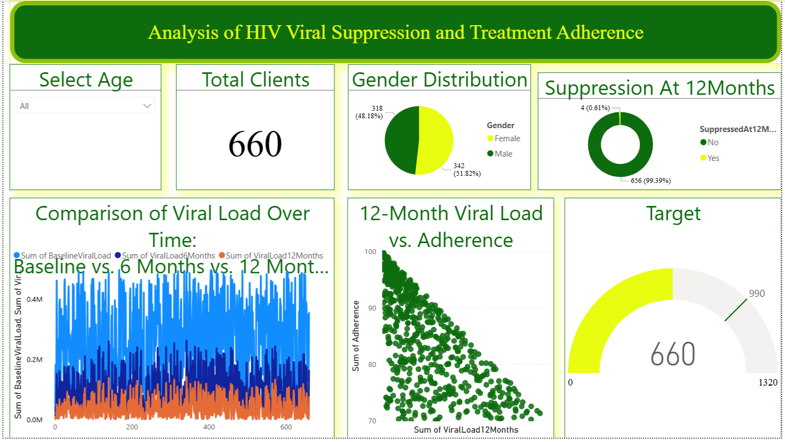

# HIV Treatment Analysis Dashboard

**📌 Project Overview**  
This interactive **Power BI dashboard** provides a data-driven view of **HIV viral suppression** and **treatment adherence trends**.  
It is designed to support decision-making in public health programs by translating complex datasets into actionable insights that improve patient outcomes.

---

## 🚀 Key Insights
- **High Viral Suppression Rate:** 99.39% at 12 months among 660 clients.
- **Balanced Gender Distribution:** 51.82% Female, 48.18% Male.
- **Improved Health Outcomes:** Significant reduction in viral load from baseline to 6 and 12 months.
- **Adherence Matters:** Clear correlation between treatment adherence and long-term viral suppression.

---

## 🛠 Tools & Skills Demonstrated
- **Power BI** — Data modeling, visualization, and interactive dashboard creation.
- **Public Health Analytics** — Translating health data into actionable insights.
- **Data Storytelling** — Presenting analytics in a decision-focused, engaging format.
- **Performance Tracking** — KPI measurement for program evaluation.

---

## 📊 Dashboard Preview

---

## 💡 Why This Matters
Public health programs rely on **timely, accurate data insights** to allocate resources effectively and monitor progress.  
This dashboard demonstrates how **data analytics** can:
- Identify gaps in adherence.
- Highlight demographic trends.
- Support targeted interventions.

---

## 🧩 About the Author
👋 **Elizabeth Nyadimo**  

I specialize in **research-driven strategy, data analytics, and impact-focused/growth-driven  insights**.  
Through my work, I empower organizations to make **evidence-based decisions** that create measurable social and economic impact.

📍 Based in Kenya | 🌍 Serving global clients remotely  
🔗 [LinkedIn](https://www.linkedin.com/in/elizabethnyadimo)  
📧 nyadimoe@yahoo.com

---

## 🔖 Relevant Tags
`power-bi` `data-analysis` `public-health` `hiv-treatment` `dashboard` `analytics` `consulting` `data-visualization`

---

> **Turning Insights into Impact** — we help organizations transform raw data into strategies that drive results.
